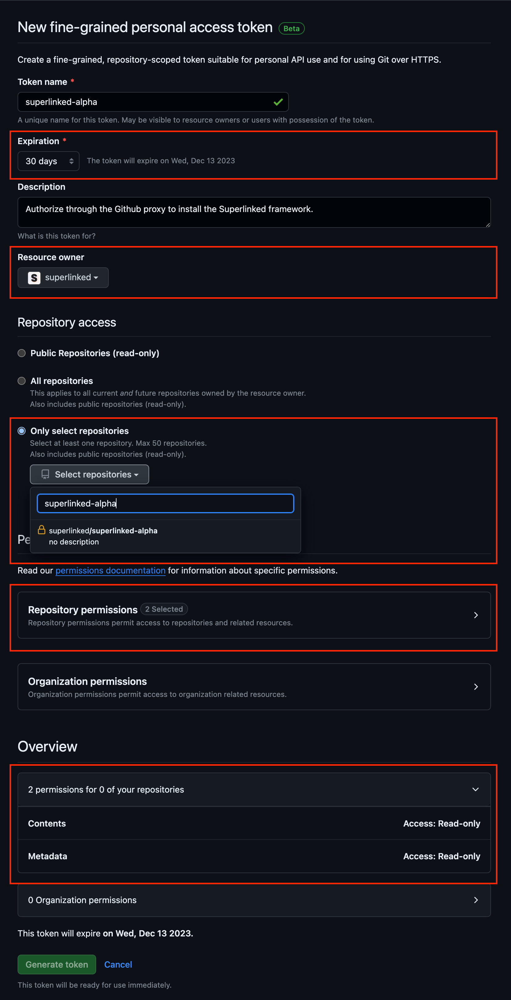

# Superlinked Alpha (v1.7.1.post22+git.121442d0)

Notebook examples to show the common use-cases of the Superlinked framework. We have created notebooks for you to be able to run the experiments right in your ennvironment with direct access to your data.

## Getting Started (Usage)

1. Create a token. ([see below](#create-a-token))
2. Import the [notebooks](./notebook/) in your preferred notebook environment.
3. Replace `YOUR_GITHUB_TOKEN` at the beginning of the notebook with your token to install the Superlinked framework.
4. Start experimenting.

> Tip: Make sure to keep your `pip install ...` script up-to-date with the latest version, if you are iterating on the notebooks.

## Welcome to Superlinked Alpha 

Our main objective is to make vector search more accessible to developers and easier to control to improve the output quality for use cases from Recommender Systems to Retrieval Augmented Generation.

With the ability to make the vector search smarter, we aim to remove the need for custom ranking models and simplify the whole stack to enable broader adoption of this powerful technology.

## What is Superlinked
1. Superlinked is a declarative Python SDK to describe your data ([Schema](https://github.com/superlinked/superlinked-alpha/tree/main/docs/superlinked/framework/common/schema)) and how you want to vectorize and query it.
2. The vectorization of data is abstracted away with [Spaces](https://github.com/superlinked/superlinked-alpha/blob/main/docs/superlinked/framework/dsl/space/space.md). These Spaces will include pre-trained language models, vision models like [CLIP](https://openai.com/research/clip), unsupervised models trained on your data like graph embeddings, and encoders for other structured data like timestamps. See the list of current and upcoming Spaces below.
3. You build out your vectors ([indexes](https://github.com/superlinked/superlinked-alpha/tree/main/docs/superlinked/framework/dsl/index)) from a composition of Spaces to vectorize your entities and any relevant metadata.
4. Then, on top of the index, we give you a query language to tap into these vector composites and define the weights of each contributing Space.

The list of currently available Spaces:
- Text Similarity
- Recency

Upcoming Spaces we are working on:
- Scalar Maximizer & Minimizer
- Categorical Similarity
- Scalar Similarity
- Semantic Image Similarity
- Structural (Graph) Similarity
- Time Series Similarity

Do you have a Space you would like to use? Tell us in [discussions](https://github.com/superlinked/superlinked-alpha/discussions)!
## How to use Superlinked
We are rolling out Superlinked in 3 milestones of increasing production readiness:
### 1. In-process with In-memory Executor Q4’23
The current version in this repository is meant to run in-process - you can experiment with it in a Python notebook or bundle it with your application.
### 2. Mini-production with Real-time Executor Q1’24
Run the same Superlinked SDK code as a service in your own cloud or on-prem environment using our built-in Docker image bundler:
- Interact with the service using auto-generated APIs based on your Source and Query definitions.
- Use more advanced Spaces like Graph embeddings which require an unsupervised training loop running over your data.
- Ingest 1M objects per hour (including the execution of all the transformations and embedding model inference) and a query performance of the order of 10s of milliseconds for 100s of QPS.
- Includes everything you need - a vector database (starting with Redis but expanding to other options soon) and a key-value store that supports real-time execution. Superlinked fully manages the index creation and state management for all attached stores - we work closely with these teams and know how to maximise their systems' performance.
- Supports basic production capabilities, like rebuilding its own state from a journal file in cloud storage in the case of an unplanned restart.

### 3. Production with Apache Spark & Real-time Executors Q2’24
The large scale deployment will be controlled using the same declarative SDK and it will give you, out of the box:
- Ingest data from your core data infrastructure, using Trino or similar distributed SQL-controlled data extraction technology. We will enable you to run this continuously or based on triggers or a set schedule.
- Fine-tune and train larger models, completely handled and made easy.
- Process TBs of data and process high QPS data streams in a distributed fashion.
- Manage the downstream vector and storage solutions in a way that reconciles batch and streaming updates.

## Reference

You can find a reference of the building blocks in the [docs](./docs/superlinked/framework) folder categorized by modules.

Some of the key components are:
1. [@schema](./docs/superlinked/framework/common/schema/schema.md): Define your schema classes.
2. [Space](./docs/superlinked/framework/dsl/space/index.md): Define embeddings on top of fields of one or more [schema](./docs/superlinked/framework/common/schema/schema_object.md) objects.
3. [Index](./docs/superlinked/framework/dsl/index/index.m.md): Organize your spaces into queriable indicies.
4. [Query](./docs/superlinked/framework/dsl/query/query.md): Define queries with parameters and weights.
5. [Source](./docs/superlinked/framework/dsl/source/index.md): Connect data sources to your schema.
6. [Parser](./docs/superlinked/framework/common/parser): Convenience tools to transform your data to schemas.  (e.g.: from [`pd.DataFrame`](./docs/superlinked/framework/common/parser/dataframe_parser.md))
7. [Executor](./docs/superlinked/framework/dsl/executor/in_memory/in_memory_executor.md): Run your configuration.

To learn more about the components and the use-cases we suggest to setup and check the examples in the [notebooks](./notebook/).

## Create a token

> You need to create a personal access token that is scoped to the superlinked-alpha project with the necessary permissions. 

1. Create a [new access token](https://github.com/settings/personal-access-tokens/new) on GitHub
1. Adjust the expiration date.
1. Select `superlinked` as the resource owner.
1. Select the `superlinked/superlinked-alpha` repository.
1. Provide read-only access on `Content` and `Metadata`.
1. Generate token.

## Contributing

If you encounter any challanges during your experiment, feel free to create an [issue](https://github.com/superlinked/superlinked-alpha/issues/new?assignees=kembala&labels=bug&projects=&template=bug_report.md&title=), request a [feature](https://github.com/superlinked/superlinked-alpha/issues/new?assignees=kembala&labels=enhancement&projects=&template=feature_request.md&title=) or to [start a discussion](https://github.com/superlinked/superlinked-alpha/discussions/new/choose).
Make sure to group your feedback in separate issues and discussions by topic. We are grateful for every and any feedback we can gather.
